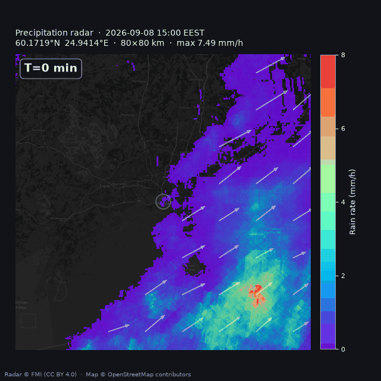

# FMI precipitation radar for Home Assistant

HACS custom integration: crop FMI precipitation radar around a location, overlay rain on a map, and expose **DRY/RAIN**, rain rate, 5/10/15-minute nowcasts, and map cameras inside Home Assistant.



Uses the FMI **Finnish** radar composite ([open GeoTIFF](https://en.ilmatieteenlaitos.fi/radar-data-on-aws-s3)). The grid covers Finland and neighbouring parts of Estonia, Sweden, and Norway (for example Tallinn, Stockholm, and Tromsø). It does not cover all of Sweden or Norway (Oslo and Gothenburg are outside), and it is not the separate NORDRAD Nordic animation. Setup rejects coordinates outside that grid.

Polling **starts when Home Assistant loads the integration** and **stops when HA shuts down**, or when you disable/remove the entry.

Add it as a [HACS custom repository](https://www.hacs.xyz/docs/faq/custom_repositories/) (type **Integration**). HACS expects the [integration layout](https://www.hacs.xyz/docs/publish/integration/) used here: `hacs.json` at the repo root and `custom_components/fmi_radar/`.

## Install with HACS

1. HACS → ⋮ → **Custom repositories** → URL `https://github.com/mjkvaak/fmi_hass` → type **Integration** → **Add** ([steps](https://www.hacs.xyz/docs/faq/custom_repositories/)).
2. Download **Precipitation radar**.
3. **Restart Home Assistant** (required after adding a custom component). First start installs `matplotlib`, `pyproj`, and `xyzservices` only — not GDAL/`rasterio`, which cannot be built inside Home Assistant Container (Alpine).
4. Settings → Devices & services → **Add integration** → FMI Precipitation Radar.
5. Set **latitude / longitude** (defaults to the Home Assistant home location if that is inside the composite, otherwise Helsinki centre), **map box** (keep it small to limit CPU and memory; default 40 km), **alert zone** (the rain/dry disk, not the full map), optical-flow padding, theme, and update interval (1–30 minutes, default 5). Theme **hass** (the default) styles the GIF and stills from the backend-selected HA theme when that can be inferred (theme name or background color); if HA is on the built-in default theme, **sun.sun** is used as a stand-in because each browser’s Auto dark/light mode is not visible to the backend. Force **dark** or **light** if you want a fixed map.

Change those later under the integration’s **Configure** options; HA reloads the entry so polling picks up the new values.

## Entities


| Entity                        | Meaning                                    |
| ----------------------------- | ------------------------------------------ |
| `sensor.*_status`             | `RAIN` / `DRY`                             |
| `sensor.*_mean_rr` / `max_rr` | mm/h inside the alert disk                 |
| `sensor.*_timestamp`          | Product time (UTC)                         |
| `binary_sensor.*_raining`     | Alert disk wet now                         |
| `binary_sensor.*_will_rain_*` | Optical-flow nowcast at +5 / +10 / +15 min |
| `camera.*_map`                | PNG still                                  |
| `camera.*_nowcast`            | GIF T=0…+15                                |


Maps are also written to `/config/www/fmi_radar/<entry>/` so Lovelace can use `/local/fmi_radar/<entry>/output.png` or `radar.gif`. Keep `output/` out of git; rendered maps include the crop centre.

```yaml
type: picture-entity
entity: camera.fmi_radar_map
show_state: false
```


## Data notes

FMI GeoTIFF: `Z[dBZ] = 0.5 * pixel - 32`. Rain rate uses Marshall–Palmer `Z = 200 R^1.6`. Linear colour scale 0–8 mm/h.

Optical flow uses T=−15…0 on `box_km` plus `of_padding_km` on **each side** of the map (so rain can be tracked as it moves in), then advects up to 30 minutes. Live T=0 is aligned toward wall-clock now so S3 publish lag is absorbed. If the FMI product is **older than 15 minutes**, the live run raises an error (HA entities go unavailable) because T=0…+15 cannot be nowcast. Historic CLI `--time` keeps T=0 at the requested composite and skips that check.

Logs go to the `fmi_radar` logger (Home Assistant **Settings → System → Logs**, or `logger: logs: fmi_radar: debug` in `configuration.yaml`). The CLI prints the same messages to stderr.

## Attribution

Weather radar composites come from the [Finnish Meteorological Institute](https://en.ilmatieteenlaitos.fi/) (Ilmatieteen laitos) [open data](https://en.ilmatieteenlaitos.fi/open-data) service, [radar GeoTIFF on AWS S3](https://en.ilmatieteenlaitos.fi/radar-data-on-aws-s3). Licence: [CC BY 4.0](https://creativecommons.org/licenses/by/4.0/) as stated in FMI’s [open data licence](https://en.ilmatieteenlaitos.fi/open-data-licence).

This project **adapts** that data: it crops a local window, converts reflectivity to rain rate, overlays OpenStreetMap, and advects a short nowcast. Rendered maps already include `Radar © FMI (CC BY 4.0)`.

Basemap tiles: © [OpenStreetMap](https://www.openstreetmap.org/copyright) contributors.

## CLI (optional, same library)

For local debugging without Home Assistant:

```bash
python3 -m venv .venv
source .venv/bin/activate
pip install -r requirements.txt
export PYTHONPATH=custom_components
python -m fmi_radar --theme dark --format both
```

MQTT publish remains available on the CLI only (`FMI_RADAR_MQTT_HOST`); the integration uses native HA entities instead.

## Tests

```bash
pip install -r requirements-dev.txt
python -m pytest
```


## Sidecar / MQTT

The previous timer + MQTT path still works if you run the CLI on a schedule. See **[docs/hass.md](docs/hass.md)** for Mosquitto and systemd notes. Prefer the HACS integration when HA can reach FMI S3.
